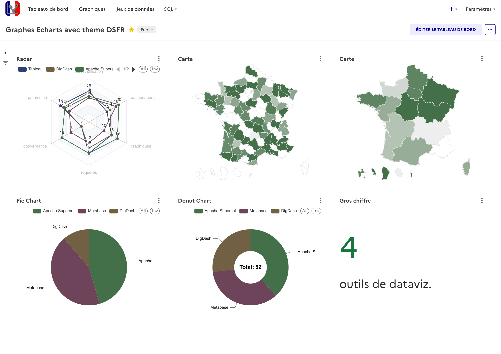

#  ChartsGouv : L'outil de visualisation de données de l'État  

--

## Résumé

**ChartsGouv** est une distribution d’[Apache Superset](https://superset.apache.org/) intégrant le **thème DSFR** (Design Système de l’État Français).  
Elle vise à fournir un **Superset DSFR** prêt à l’emploi pour les administrations publiques, avec :

- une identité visuelle conforme au **DSFR**,  
- une accessibilité renforcée,  
- des guides et extensions adaptées à l’usage dans la sphère publique,  
- des tableaux de bord mutualisables et reproductibles.  

Cette version “Superset DSFR” est développée dans une logique **open-source et souveraine**, sous licence **EUPL v1.2**.

---  
## Description
> [!IMPORTANT]  
> Ce projet n'est pas un fork du repo officiel de Superset.  

Ce projet est une extension du projet Superset. Il vise à compléter cet outil en y intégrant la couche DSFR de l'État. Il a aussi vocation à expérimenter des fonctionnalités spécifiques propres aux besoins des administrations et aux utilisateurs francophones de cet outils.

### Démonstration

### Captures d'écran

| Description | Image |
| --- | --- |
|Police Marianne :fr:, Couleurs :art:||
|Palettes de couleurs :art:||
|Composants DSFR :control_knobs:||
|DSFR Charts :chart_with_upwards_trend:||
|DSFR Charts :chart_with_upwards_trend:||
|Page d'erreur 404 :x:||

# Liens communauté et écosystème

- [Shillelagh-GristAPI](https://github.com/qleroy/shillelagh-gristapi) – connecter Grist et Superset.  
- [Documentation MTE](https://snum.gitlab-pages.din.developpement-durable.gouv.fr) – usages et guides ministériels.  

> [!NOTE]  
> Certains éléments de cette documentation sont propres à l'environnement du MTE.  
> 
Si vous souhaitez y contribuer, vous pouvez trouver des contacts dans la section "A propos" du site

### Accès rapides
- :art: [Thème DSFR](./superset/)

## License
This project is distributed under the EUPL v1.2 license — see the LICENSE file for more details.
