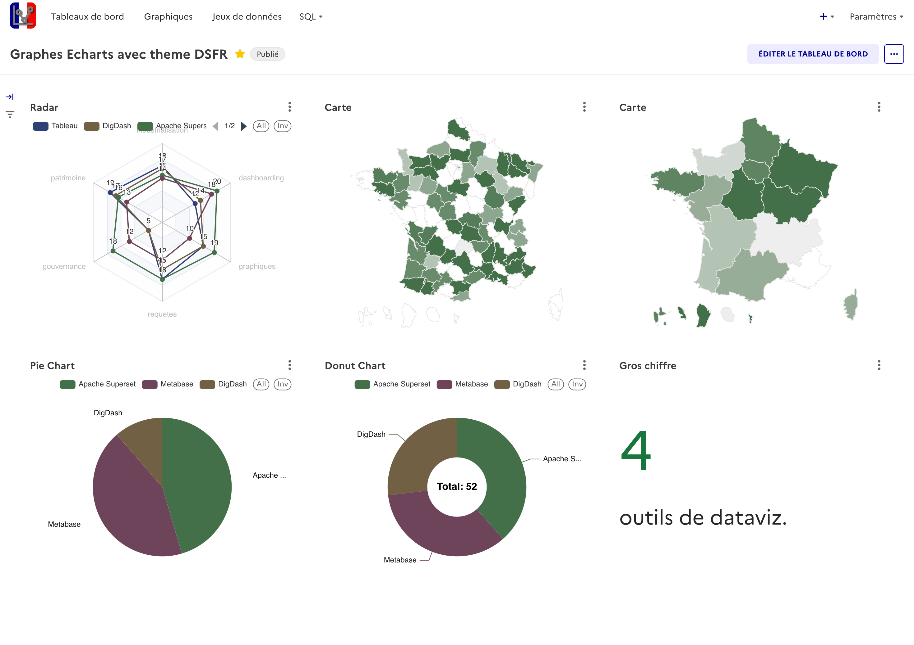

#  ChartsGouv : L'outil de visualisation de données de l'État  

---

## Résumé

**ChartsGouv** est une distribution d’[Apache Superset](https://superset.apache.org/) intégrant le **thème DSFR** (Design Système de l’État Français).  
Elle vise à fournir un **Superset DSFR** prêt à l’emploi pour les administrations publiques, avec :

- une identité visuelle conforme au **DSFR**,  
- une accessibilité renforcée,  
- des guides et extensions adaptées à l’usage dans la sphère publique,  
- des tableaux de bord mutualisables et reproductibles.  

Cette version “Superset DSFR” est développée dans une logique **open-source et souveraine**, sous licence **EUPL v1.2**.

---

## Accès rapides
- :art: [Thème DSFR](./superset-dsfr/)
- :green_book: [Documentation](./docs/)

---

## Liens communauté et écosystème

- [shillelagh-gristapi](https://github.com/qleroy/shillelagh-gristapi) – connecter Grist et Superset.  
- [django-superset-integration](https://github.com/B-Alica/django-superset-integration) - intégration Django et Superset.
- [Documentation MTE](https://snum.gitlab-pages.din.developpement-durable.gouv.fr) – usages et guides ministériels.  Note: certains éléments de cette documentation sont propres à l'environnement du MTE. Si vous souhaitez y contribuer, vous pouvez trouver des contacts dans la section "A propos" du site.

---

## Vidéo d'exemple

---

## Captures d’écran : Superset DSFR en action

| Description | Image |
| --- | --- |
|Police Marianne :fr:, Couleurs :art:||
|Palettes de couleurs :art:||
|Palettes de couleurs :art:||
|Composants DSFR :control_knobs:||
|Page d'erreur 404 :x:||

---

## FAQ – Superset DSFR

**Qu’est-ce que Superset DSFR ?**  
C’est une distribution d’Apache Superset adaptée à l’administration française, avec un thème DSFR et une configuration prête à l’emploi.

**Puis-je installer Superset DSFR dans mon ministère / collectivité ?**  
Oui, via Docker ou Helm, en suivant les guides d’installation.

**Est-ce compatible avec la version officielle d’Apache Superset ?**  
Oui, ChartsGouv étend Superset sans en modifier le cœur.

**Pourquoi utiliser le DSFR dans Superset ?**  
Pour garantir une cohérence visuelle et d’accessibilité dans toutes les interfaces numériques de l’État.

---

## License
This project is distributed under the EUPL v1.2 license — see the LICENSE file for more details.
