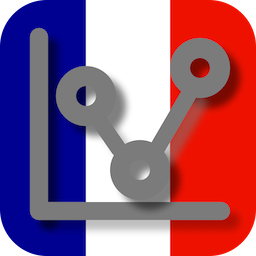
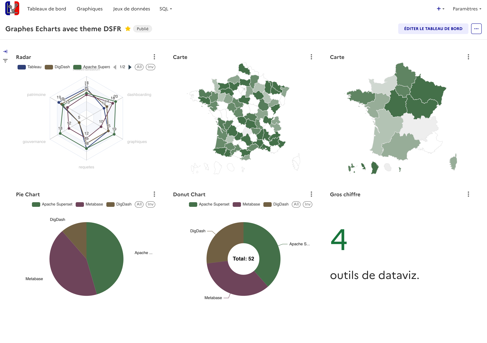

[ACTUALISER LA DOC]
- Modifier le wording
- Lien vers la vidéo
- Captures d'écran
- Liens vers les dashboards de démo
- structure du répo
- Lien vers la doc du MTE (=doc de prise en main de Superset)
- Lien vers nos guides
- Liens vers les répo de la communaté + évènements BlueHat
- En quoi consiste le thème DSFR
- (optionnel) Lien vers le salon Tchap

#  Thème DSFR pour Apache Superset

Superset DSFR est une extension de l'outil de datavisualisation Apache Superset. Elle contient tous les éléments de permettant d'appliquer la charte graphique de l'Etat sur ses tableaux de bord !

## Démonstration vidéo 

## Parcourir les dashboards d'exemple
- [Dashboard SILL](http://chartsgouv.lab.sspcloud.fr/superset/dashboard/sill/)
- [Graphes Apache Echarts avec couleurs DSFR](http://chartsgouv.lab.sspcloud.fr/superset/dashboard/demo-echarts/)
- [Composants DSFR et DSFR charts](http://chartsgouv.lab.sspcloud.fr/superset/dashboard/demo-dsfr/?standalone=2)

### Contexte
Ce projet est né d'un constat simple: il existe une multitude d'outils propriétaires au sein de l'État, ce qui complique la montée en compétence des agents, empêche la revaloration de leurs compétences auprès d'autres administrations et rend difficile la mutualisation des connaissances.  

Ce projet a été inité par l'intermédiaire du [programme 10%](https://www.10pourcent.etalab.gouv.fr/), programme interministériel co-porté par la DINUM et l'INSEE. Il a permis à plusieurs agents de différentes administrations de collaborer sur leurs problématiques communes.
  
## Description
> [!IMPORTANT]  
> Ce projet n'est pas un fork du repo officiel de Superset.  

Ce projet est une extension du projet Superset. Il vise à compléter cet outil en y intégrant la couche DSFR de l'État. Il a aussi vocation à expérimenter des fonctionnalités spécifiques propres aux besoins des administrations et aux utilisateurs francophones de cet outils.

### Démonstration

### Accès rapides
- :art: [Thème DSFR](./superset/)

### Installation
Un guide d'installation est disponible ici: [./INSTALLATION.md](./INSTALLATION.md)

### Prise en main
Une documentation française a été rédigée par le MTE.  
Pour la consulter, rendez-vous sur [ce site](https://snum.gitlab-pages.din.developpement-durable.gouv.fr/ds/gd3ia/offre-dataviz-documentation/).  
> [!NOTE]  
> Certains éléments de cette documentation sont propres à l'environnement du MTE.  
> 
Si vous souhaitez y contribuer, vous pouvez trouver des contacts dans la section "A propos" du site

## License
This project is distributed under the EUPL v1.2 license — see the LICENSE file for more details.
